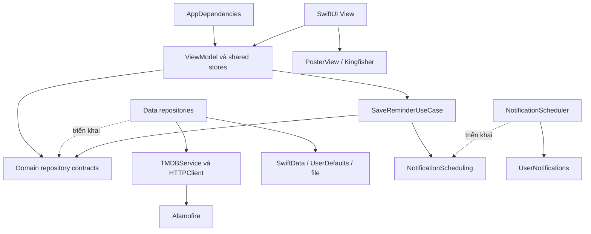

# MoviesSwiftUI

Ứng dụng học SwiftUI được viết lại từ MovieStore Objective-C/UIKit. App dùng UI native, giữ bốn tab và các chức năng của bản mẫu, đồng thời sửa các vấn đề về phân trang, sắp xếp, state, ảnh đại diện và notification routing.

Đây là app mới: không chuyển database hoặc UserDefaults từ app Objective-C.

## Môi trường và thiết lập

- Deployment target: iOS 18.6; iPhone và iPad.
- Project dùng Swift language mode 5, mặc định actor isolation là MainActor.
- Alamofire 5.12.2: networking và Decodable serializer.
- Kingfisher 8.13.0: tải/cache ảnh qua KFImage.
- Alamofire 5.12.2 có manifest yêu cầu swift-tools 6.4; cần toolchain hỗ trợ phiên bản này. Chưa xác nhận compatibility bằng build.
- Các phần còn lại dùng SwiftUI, Observation, Combine, SwiftData, PhotosUI, UIKit, WebKit và UserNotifications của Apple.

Mở `MoviesSwiftUI.xcodeproj`, chọn team ký app phù hợp và để Xcode resolve hai package đã có. Target chỉ link product Alamofire; product AlamofireDynamic trùng đã được bỏ.

### TMDB API key

1. Sao chép `Configuration/TMDBSecrets.example.xcconfig` thành `Configuration/TMDBSecrets.xcconfig` nếu chưa có file local.
2. Điền key vào `TMDB_API_KEY`.
3. `App.xcconfig` include file local; `Info.plist` đưa giá trị vào `TMDBAPIKey` của bundle.
4. `TMDBService` kiểm tra key trước khi tạo request. Thiếu key hiển thị lỗi cấu hình.

File key local bị `.gitignore` bỏ qua. Trong đợt migration, file local được điền từ source cũ nếu tìm được key; key đó chưa được xác minh với server. API key nhúng trong app client có thể bị trích xuất, nên cơ chế này chủ yếu tránh commit nhầm, không bảo đảm giữ bí mật tuyệt đối.

App không log URL chứa API key. `HTTPClient.lastUnderlyingError` giữ lỗi gốc trong bộ nhớ để chẩn đoán, còn UI dùng thông báo từ `AppError`.

### Quyền hệ thống

- Camera: xin khi người dùng chọn Chụp ảnh; thông điệp quyền nằm trong `Configuration/Info.plist`.
- Thư viện ảnh: dùng PhotosPicker, không yêu cầu quyền đọc toàn bộ thư viện.
- Notification: xin khi lưu reminder đầu tiên, không xin ngay lúc mở app.
- Camera cần kiểm tra trên thiết bị thật. Notification và thao tác tap khi app đã đóng cũng cần kiểm tra thực tế.

## Các chức năng

- Movies: Popular, Top Rated, Upcoming, Now Playing; list/grid, refresh, phân trang.
- Detail: thông tin phim, diễn viên, Favorite và đặt lịch nhắc.
- Favorites: snapshot local, tìm kiếm tên bằng Combine và xóa có xác nhận.
- Settings: draft; Save áp dụng loại danh sách, filter và sort local.
- Profile: draft, validation, chọn/chụp ảnh và lưu avatar thành file.
- Reminders: lịch sắp tới tăng dần, lịch đã qua giảm dần; menu hiện hai lịch sắp tới gần nhất.
- About: WKWebView với Back, Forward, Refresh và JavaScript dialog native.
- iPad: Movies/Favorites chia danh sách–chi tiết; cửa sổ hẹp collapse về một cột.

Không có tài khoản, cloud sync, mua vé, tìm kiếm toàn TMDB hoặc Detail offline đầy đủ. Favorite local chỉ là snapshot dùng để dựng row; mở Detail vẫn gọi API.

## Cấu trúc và trách nhiệm

```text
MoviesSwiftUI/
├── MoviesSwiftUIApp.swift
├── App/                      # Bootstrap, composition root, tabs và router
├── Domain/
│   ├── Models/               # Value types, không phụ thuộc SwiftUI/SwiftData/Alamofire
│   ├── Repositories/         # Contracts của nguồn dữ liệu
│   ├── Services/             # Contract đặt notification
│   └── UseCases/             # SaveReminderUseCase phối hợp local + hệ thống
├── Data/
│   ├── Remote/               # HTTPClient, TMDBService và DTO JSON
│   ├── Local/                # SwiftData và file avatar
│   ├── Mappers/              # DTO → Domain
│   └── Repositories/         # Triển khai contracts Domain
├── Presentation/
│   ├── Stores/               # Snapshot dùng chung giữa nhiều màn
│   ├── Features/             # View/ViewModel theo tính năng
│   └── Bridges/              # CameraPicker và WebView
├── PreviewSupport/           # Dữ liệu mẫu và Environment cho Canvas (chỉ Debug)
├── Shared/
│   ├── Components/           # Poster, loading, lỗi, empty và alert
│   └── Theme/                # Màu chủ đạo và chiều rộng nội dung
└── Assets.xcassets/           # Asset catalog của target
Configuration/                # xcconfig, Info.plist và mẫu key
```



View không tự tạo Session hoặc ModelContext. AppDependencies tạo các implementation, rồi inject vào ViewModel/store. Protocol chỉ được thêm tại ranh giới nguồn dữ liệu hoặc hệ thống, không tạo base class/generic layer cho mọi màn.

## State ownership: biến nào thuộc về ai?

| Biến / dữ liệu | Owner | Thay đổi khi nào? | Lưu lâu dài? |
| --- | --- | --- | --- |
| `dependencies` | AppBootstrap | Bootstrap thành công một lần | Không |
| `selectedTab`, movie ID, compact column | AppRouter | Chọn tab/phim hoặc notification tap | Không |
| `menuPresented`, `reminderMovie` | AppRouter | Mở/đóng presentation | Không |
| `pendingMovieID` | AppRouter | Chờ thao tác lưu và dismissal hoàn tất | Không |
| `movies`, `nextPage`, `totalPages` | MoviesViewModel | Request thuộc generation hiện tại thành công | Không |
| `requestGeneration` | MoviesViewModel | Refresh, đổi settings, hủy công việc | Không |
| `detail`, `cast` và lỗi từng phần | MovieDetailViewModel | Hai request độc lập hoàn tất | Không |
| `favorites`, `reminders` | MovieLibraryStore | Đọc local/lưu local thành công | SwiftData |
| `scheduleStatuses` | MovieLibraryStore | Đặt lịch hoặc đối chiếu pending requests | Không |
| `savingReminderIDs`, `reminderTasks` | MovieLibraryStore | Trong toàn bộ luồng lưu lịch + đặt thông báo | Không |
| `appliedSettings`, `revision` | SettingsStore | Sau Save; revision tăng cả khi giá trị không đổi | Settings lưu UserDefaults |
| `draftSettings` | SettingsViewModel | Sửa form; reset khi rời/quay lại màn | Không |
| `profile`, `avatarData` | ProfileStore | Sau lưu Profile thành công | UserDefaults + file |
| `draft`, `newAvatarData`, `imageToken` | ProfileEditViewModel | Chỉnh form/chọn ảnh; bỏ khi hủy | Không |
| `searchText`, `appliedQuery` | FavoritesViewModel | Nhập tức thì / áp dụng sau debounce | Không |
| `subscriptionToken`, `cancellable` | FavoritesViewModel | Reset/clear/rời màn tìm kiếm | Không |
| `now` | RemindersViewModel | Foreground hoặc tới mốc reminder tiếp theo | Không |

Snapshot dùng chung chỉ đổi sau khi persistence thành công. Ví dụ Favorite không đổi icon trước khi lưu; lỗi database giữ trạng thái cũ.

Draft là bản chỉnh sửa chưa áp dụng. Binding của form ghi vào draft, không ghi trực tiếp vào ProfileStore/SettingsStore.

## Observation và các wrapper SwiftUI

### `@Observable`

Đây là macro của Observation, không phải property wrapper. Macro giúp SwiftUI theo dõi các thuộc tính observable được đọc trong `body`; khi chúng thay đổi, SwiftUI tính lại phần giao diện liên quan.

ViewModel và shared stores trong app dùng `@Observable`. Macro không tự gọi API, không tự lưu database và không tự tạo Combine publisher.

### `@State`

View dùng `@State` để giữ instance ViewModel hoặc giá trị UI do chính View sở hữu. SwiftUI có thể tạo lại struct View nhiều lần; state được giữ theo identity/vị trí của View, không chỉ theo vòng đời của một struct tạm.

Ví dụ MoviesView tạo model trong initializer bằng `State(initialValue:)`. Đổi list/grid không được tạo lại Session, database hoặc cố ý tải lại page 1.

### `@Bindable`

Tạo binding vào thuộc tính của một object `@Observable` đã có. `@Bindable var model = model` trong body cho phép dùng `$model.draftSettings.category` với Picker.

`@Bindable` không sở hữu một bản sao dữ liệu. Khi Picker ghi binding, nó sửa thuộc tính của đúng model đó.

### `@Binding`

Binding là quyền đọc/ghi vào nguồn dữ liệu do nơi khác sở hữu. Component nhận Binding không nên tạo thêm một state cùng ý nghĩa rồi cố đồng bộ hai bản.

Trong app, `messageAlert` nhận `Binding<String?>`; alert đóng bằng cách ghi nil vào state lỗi của feature. `$model.searchText` là Binding mà TextField/searchable có thể ghi.

### `@Environment`

Inject dependency/state dùng chung xuống cây View. AppRoot inject library, profile, settings và router; View đọc bằng `@Environment(MovieLibraryStore.self)`.

Đây là dependency theo cây View, không phải biến global. Repository riêng của feature vẫn được truyền qua initializer để ranh giới dữ liệu rõ ràng.

### `@ObservationIgnored`

Task, Combine subscription và WKWebView reference là công cụ điều phối, không phải dữ liệu để dựng UI. Chúng được loại khỏi Observation khi thích hợp.

State UI như `isLoading` vẫn observable. Không dùng `@ObservationIgnored` để che một giá trị View cần theo dõi.

## Học UI bằng SwiftUI Preview

Các component và màn hình SwiftUI chính đã có `#Preview` ở cuối file. Phần này dành để học bố cục, control native và state đơn giản; chưa mô phỏng toàn bộ app hay các tình huống API phức tạp.

### Cách mở và sử dụng

1. Mở một file như `MovieRow.swift`, `MoviesView.swift` hoặc `SettingsView.swift` trong Xcode.
2. Bật **Editor → Canvas**, rồi **Resume** nếu Canvas đang tạm dừng.
3. Chọn ví dụ theo tên Preview. `FavoritesView.swift` có cả danh sách mẫu và danh sách rỗng.
4. Chọn Preview destination iPhone/iPad để xem bố cục theo thiết bị. Đổi appearance và cỡ chữ trong Canvas để học Dark Mode/Dynamic Type.
5. Bật chế độ tương tác để thử Favorite, đổi list/grid, tìm kiếm hoặc sửa form. Khi đổi code hoặc tạo lại Preview, dữ liệu mẫu có thể được khởi tạo lại.

Preview vẫn cần Xcode biên dịch code và resolve các package. Dữ liệu mẫu không cần TMDB API key hoặc mạng; điều này không có nghĩa Canvas chạy được khi project đang có lỗi compile.

### Từ Preview đơn giản đến màn có dependency

Một component chỉ nhận giá trị có thể dựng trực tiếp:

```swift
#if DEBUG
#Preview("Poster", traits: .sizeThatFitsLayout) {
    PosterView(path: nil, width: 130, height: 195).padding()
}
#endif
```

`#Preview` là macro giúp Xcode tìm ví dụ UI và dựng nó trong Canvas. Closure trả về View, không thêm một màn mới vào navigation của app. `.sizeThatFitsLayout` phù hợp khi chỉ muốn xem kích thước nội dung của component thay vì một màn hình đầy đủ.

Với một biến tương tác nhỏ, `@Previewable @State` cho phép đặt state ngay trong closure. Xem `MovieRow.swift`: bấm nút gọi `isFavorite.toggle()`, state đổi và SwiftUI cập nhật trái tim. Macro `@Previewable` tạo View chứa property wrapper ở phía sau; không dùng nó để khai báo state trong closure thông thường.

Màn có ViewModel và Environment dùng helper chung:

```swift
#if DEBUG
#Preview("Movies") {
    PreviewHost { context in
        MoviesView(repository: context.movieRepository)
    }
}
#endif
```

`PreviewHost` giữ một `PreviewContext` bằng `@State` và cấp `MovieLibraryStore`, `SettingsStore`, `ProfileStore`, `AppRouter` bằng `.environment(...)`. Các màn dùng `@Environment(Type.self)` cần những object này; truyền repository thôi chưa đủ. Host giữ cùng instance cho ViewModel và Environment để state không bị chia thành hai nguồn khác nhau.

`PreviewContext` tạo các implementation nhỏ của protocol có sẵn. Repository phim trả `PreviewSampleData`, nên `.task` của ViewModel thật vẫn chạy qua luồng nhận dữ liệu bình thường. Favorite, reminder, settings và profile mẫu lưu trong bộ nhớ, không mở SwiftData hay dùng UserDefaults thật. Mỗi context có bộ state riêng, không dùng singleton; tìm kiếm Favorites vẫn chạy Combine thật.

Nếu thử lưu ảnh profile, `AvatarFileStorage` nhận thư mục tạm có UUID của context thay vì Application Support. Context dọn thư mục này khi được giải phóng. Scheduler mẫu chỉ trả kết quả giả lập trong bộ nhớ, không xin quyền hoặc đặt notification thật. Mọi ảnh phim/diễn viên mẫu có path `nil`, nên chỉ hiện placeholder và không tải ảnh từ TMDB.

Các khai báo Preview và helper được bọc `#if DEBUG`, không đưa vào bản Release. App chạy bình thường vẫn dùng dependency thật do `AppDependencies` tạo; helper Preview không thay đổi bootstrap của app.

### Nên đọc file nào trước?

- `MovieRow.swift`: ví dụ component và `@Previewable @State` tương tác.
- `MovieGridItem.swift`: item đặt trong `LazyVGrid` để học layout theo chiều rộng.
- `PreviewSampleData.swift`: sửa tên, điểm, ngày và nội dung để thử UI.
- `PreviewHost.swift` và `PreviewContext.swift`: cách cấp dependency/Environment mẫu cho màn thật.
- `MoviesView.swift`, `FavoritesView.swift`, `SettingsView.swift`: List/Grid, search và Form.
- `MovieDetailView.swift`, `ProfileEditView.swift`, `RemindersView.swift`: màn con cần bọc `NavigationStack` khi Preview độc lập. Menu, Settings và ReminderEditor đã có stack/container riêng, không bọc thêm.

### Giới hạn có chủ đích

Host chỉ cấp dependency để xem từng màn; nó không dựng `AppRootView` hoặc xử lý presentation/routing toàn app. Nút mở menu, nút đặt lịch ở Detail và thao tác mở phim từ reminder cần app root để hoàn tất luồng; xem menu/editor qua Preview riêng của chúng. Nút Favorite, tìm kiếm, xóa Favorite, đổi list/grid và các control form vẫn dùng state/logic thật với dữ liệu mẫu. Đóng/lưu một màn Preview standalone có thể không dismiss vì không có màn cha đang present nó.

Chưa thêm Preview cho About/WebView và camera: những phần này phụ thuộc trang web hoặc UI hệ thống. PhotosPicker, camera, quyền notification, persistence thực tế và navigation toàn app cần kiểm tra bằng Simulator/thiết bị. Preview giúp chỉnh UI nhanh, không thay thế build/test app.

## JSON parsing khác binding ở đâu?

JSON parsing dùng `Decodable`, `JSONDecoder` và CodingKeys, giống một app UIKit viết bằng Swift. SwiftUI không làm thay đổi cấu trúc JSON của TMDB.

Luồng thực tế:

1. Alamofire kiểm tra HTTP status và decode JSON thành MoviePageDTO/MovieDTO/CreditsDTO.
2. MovieMapper chuyển tên trường và giá trị optional thành Domain model.
3. ViewModel nhận kết quả, kiểm tra generation/cancellation rồi cập nhật state.
4. Observation làm View hiển thị state mới.

Poster/ngày/overview thiếu có fallback phù hợp. Cấu trúc response sai, thiếu danh sách bắt buộc hoặc ID không hợp lệ là lỗi; không tự đổi thành danh sách rỗng như tải thành công.

MovieReleaseDate chứa năm/tháng/ngày để ngày phát hành không đổi theo múi giờ. Reminder dùng Date vì cần một thời điểm thật để đặt notification.

## Async/await, MainActor và lifecycle

ViewModel/store cập nhật state trên MainActor. MainActor là nơi điều phối UI, không có nghĩa tất cả API phải blocking trên main thread; Alamofire/URLSession thực hiện network bất đồng bộ.

DTO được khai báo `nonisolated` và `Sendable` để phù hợp serializer bên ngoài MainActor của thư viện. Chỉ thêm chữ `async` không tự chuyển toàn bộ xử lý sang background.

### Vì sao không gọi API trong `body`?

SwiftUI tính body nhiều lần khi state thay đổi. Nếu body trực tiếp gọi API, một lần đổi loading hoặc Favorite có thể phát sinh request mới.

App bắt đầu công việc tại `.task` hoặc thao tác người dùng. ViewModel vẫn có guard vì `.task` cũng có thể chạy lại khi View xuất hiện hoặc identity thay đổi.

### Cancellation và generation

Cancellation giảm công việc không còn cần thiết. Generation/token chặn kết quả cũ nếu response đã hoàn thành gần thời điểm hủy.

Movies tăng generation trước khi hủy task cũ. Cả kết quả và defer kết thúc loading đều kiểm tra generation, nên request cũ không tắt indicator của request mới.

Detail dùng ID trong initializer và `.id(id)` ở host. Detail và cast có task/generation riêng, tránh một lỗi làm mất phần đã tải thành công.

### Pagination walkthrough

1. Mở Movies: `appear` đọc Settings revision, tải page 1 nếu chưa có dữ liệu hợp lệ.
2. Thành công: thay danh sách, cập nhật totalPages, đặt nextPage = 2.
3. Row cuối xuất hiện: guard cho phép một request load-more.
4. Thành công: append các ID mới rồi tăng nextPage.
5. Thất bại: giữ dữ liệu và nextPage; nút thử lại tải đúng trang đó.
6. Refresh/Save Settings: generation mới, request cũ bị hủy và không được ghi state.

Filter/sort chạy trên các trang đã tải. Trang bị filter hết vẫn có nút tải tiếp nếu server còn trang; app không tự tải toàn bộ TMDB để tìm một kết quả.

## Combine cơ bản trong Favorites

`PassthroughSubject` nhận query từ thao tác nhập. Subject không giữ giá trị hiện tại như CurrentValueSubject; `searchText` vẫn do ViewModel giữ.

Pipeline gồm:

```swift
subject.removeDuplicates()
    .debounce(for: .milliseconds(300), scheduler: RunLoop.main)
    .sink { query in
        // Áp dụng query sau khi người dùng ngừng nhập; code thực tế dùng weak self/token.
    }
```

- `removeDuplicates`: không xử lý liên tiếp cùng một query đã trim.
- `debounce`: chờ 300 ms không có input mới.
- `sink`: nhận giá trị và cập nhật appliedQuery trên MainActor.
- `AnyCancellable`: giữ subscription; cancel khi rời màn/reset.
- Weak capture: subscription không giữ ViewModel sống mãi.
- Subscription token: callback đã được chuyển sang MainActor từ pipeline cũ không áp dụng lại query cũ.

Clear áp dụng ngay query rỗng, hủy pipeline cũ và tạo pipeline mới. Thay đổi Favorite trong store vẫn cập nhật kết quả đang tìm, vì danh sách hiển thị là computed property đọc store và appliedQuery.

Networking không dùng Combine trong app này, để tách bài học async/await và bài học publisher/subscription.

## Persistence và profile

SwiftData chứa FavoriteRecord/ReminderRecord với movieID duy nhất. Mỗi record lưu snapshot Movie Codable, cùng các timestamp riêng của tính năng.

Repository tạo ModelContext riêng, tắt autosave và save rõ ràng. Các transaction local không chứa await; lỗi save gọi rollback trước khi trả về để lần sau không ghi lại một thay đổi đã thất bại.

ViewModel chỉ nhận value snapshots. App không đưa SwiftData model vào form rồi cho Binding sửa persistence trước khi người dùng Save.

Profile/Settings dùng các key `profile.v1`, `settings.v1`. UserDefaults.set không phải xác nhận flush vật lý xuống ổ đĩa; lỗi decode không bị âm thầm ghi đè bằng defaults khi app khởi động.

Avatar được downsample/resize giữ tỷ lệ và lưu JPEG thành file UUID. File mới được ghi trước khi Profile trỏ tới nó; lỗi lưu giữ avatar cũ. Image token ngăn kết quả chọn ảnh cũ hoàn thành muộn ghi đè lựa chọn mới.

## Reminder và notification walkthrough

1. Detail truyền snapshot Movie tới editor.
2. Editor bỏ phần giây và kiểm tra lại thời điểm ở lúc Save.
3. MovieLibraryStore khóa thao tác reminder, giữ Task tới khi luồng hoàn tất.
4. SaveReminderUseCase lưu local; thành công mới cập nhật snapshot.
5. NotificationScheduler kiểm tra/xin quyền và đặt calendar trigger một lần.
6. Thành công đóng editor; thất bại chỉ ở notification báo lịch đã lưu nhưng chưa đặt thông báo.

Database và UserNotifications không có transaction chung. Nếu local save thất bại, lịch hệ thống cũ còn nguyên; nếu local đã đổi giờ mà đặt notification mới thất bại, request cũ bị bỏ để không gửi sai giờ.

Identifier là `movie-reminder-{movieID}`. Không lưu bool isScheduled vào database như một sự thật lâu dài; app đối chiếu pending requests theo ID và thời điểm khi bootstrap/foreground.

App bị đóng giữa hai bước có thể để lại reminder chưa có notification. Khi mở lại, UI đánh dấu lịch đó chưa đặt được thông báo, không tự xin quyền hoặc đặt lại tất cả lịch.

AppDelegate dùng delegate async của UserNotifications và chuyển Int/String sang MainActor. Notification tap trước khi router sẵn sàng được giữ pending; router đợi thao tác lưu và dismissal hoàn tất rồi mở phim ở Movies. Root/tabs không bị dựng lại.

Lịch đã qua là lịch sử thời gian, không chứng minh notification đã được gửi hoặc được đọc. Clock task chỉ hoạt động khi màn hiển thị và scene active; đổi giờ, foreground hoặc thay đổi reminders tính lại nhóm.

## SwiftUI và UIKit tương ứng

| SwiftUI | Vai trò gần tương ứng UIKit | Khác biệt cần học |
| --- | --- | --- |
| TabView | UITabBarController | Selection là state |
| NavigationSplitView | UISplitViewController | Columns collapse theo không gian |
| NavigationStack | UINavigationController | Navigation được khai báo theo cây View/state |
| List | UITableView | Dựng row bằng ForEach, không reloadData |
| LazyVGrid | UICollectionView | Cột và item khai báo trong layout |
| Form / Picker / Slider / DatePicker | Control và các nhóm input | Binding ghi vào nguồn dữ liệu |
| `.sheet` | Present view controller | Presentation được điều khiển bằng state |
| `.alert` | UIAlertController | Nội dung/action khai báo; cần tránh presentation chồng nhau |
| PhotosPicker | Bộ chọn ảnh hệ thống | Nhận PhotosPickerItem và loadTransferable bất đồng bộ |
| UIViewControllerRepresentable | Bọc UIViewController | Dùng Coordinator nối delegate camera |
| UIViewRepresentable | Bọc UIView | make/update/dismantle tách vòng đời WKWebView |
| Observation | Cơ chế cập nhật UI theo state | Không cần closure gọi reloadData sau mỗi thay đổi |

SwiftUI View là value mô tả giao diện, không phải UIViewController thu nhỏ. `onAppear` không thay thế một-một mọi tình huống của viewDidLoad/viewWillAppear; ownership và guard của công việc vẫn cần rõ ràng.

## iPad và identity

Movies/Favorites dùng cùng NavigationSplitView trên iPhone và iPad. Router giữ movie ID và preferredCompactColumn; không dựng hai bộ ViewModel riêng bằng điều kiện isPad.

Grid dùng cột adaptive theo chiều rộng, Form giới hạn chiều rộng nội dung, Detail dùng ViewThatFits để xuống bố cục dọc khi không đủ chỗ. Dynamic Type sử dụng font semantic thay vì khóa kích thước chữ.

WebView chỉ load URL ban đầu trong makeUIView. updateUIView không gọi load, nên đổi loading/canGoBack không khởi động lại navigation. Coordinator hoàn tất JavaScript callback một lần khi xác nhận, hủy hoặc tháo view.

## Những thay đổi có chủ đích so với bản cũ

- Native sheet thay drawer MFSideMenu; chọn reminder từ menu mở phim tại Movies sau khi sheet đóng.
- SwiftData thay Core Data của app cũ; không giữ template Item.
- Không dùng global HUD hoặc NotificationCenter để ép các màn reload dữ liệu.
- Sort rating đúng chiều và ổn định; chống duplicate page/request và response cũ.
- Detail có lỗi riêng cho phim/cast; không Favorite/Reminder khi chưa có snapshot hợp lệ.
- Profile dùng enum giới tính, chặn ngày sinh tương lai, giữ tỷ lệ avatar và không mất ảnh đã chọn khi cancel picker.
- Reminder chia sắp tới/lịch sử, menu chọn hai lịch sắp tới gần nhất.
- Quyền notification xin tại tính năng; tap không reset root app.
- Nhãn diễn viên phản ánh dữ liệu cast thực tế, không gọi cast là toàn bộ crew.

## Kiểm chứng và giới hạn hiện tại

Đợt triển khai này kiểm tra source và diff/whitespace; không chạy build, tests, compiler, parser hoặc type-check theo rule của project. Không có kết quả chạy API, simulator, camera, notification hoặc kiểm chứng layout thực tế trong đợt này.

Các case cần kiểm tra khi cho phép chạy app:

| Điều kiện / thao tác | Kết quả cần đạt |
| --- | --- |
| Thiếu key / key hết hiệu lực | Lỗi cấu hình / HTTP rõ ràng |
| Kéo refresh trong lúc tải thêm | Không append response cũ |
| Save Settings nhiều lần khi mạng chậm | Chỉ revision cuối được áp dụng |
| Một trang bị filter hết | Có nút tải tiếp nếu server còn trang |
| Detail thành công, Credits lỗi | Phim vẫn hiển thị, retry chỉ cast |
| Đổi phim khi request cũ chưa xong | Phim mới không nhận dữ liệu phim cũ |
| Save/xóa Favorite thất bại | Snapshot cũ giữ nguyên |
| Nhập search rồi Clear trước 300 ms | Query cũ không trở lại |
| Chọn hai ảnh liên tiếp | Ảnh mới nhất thắng dù hoàn thành ngược thứ tự |
| Camera không có/bị từ chối | Thông báo phù hợp, không mở camera |
| Reminder editor mở lâu, chọn giờ đã qua | Không đặt lịch quá hạn |
| Local lưu được nhưng notification lỗi | Lịch còn, cảnh báo chưa đặt thông báo |
| Đóng app giữa lưu local và scheduling | Mở lại nhận biết lịch chưa có request khớp |
| Tap notification khi app đã đóng/menu đang mở | Đúng phim, một route, không reset tabs |
| Xoay iPad/thu hẹp cửa sổ với Detail đang mở | Giữ ID và dữ liệu, không fetch vì đổi layout |
| Accessibility text size lớn | Nội dung/nút không bị cắt |
| WebView loading/error/JavaScript dialog | Không reload lặp; callback được hoàn tất |
| Khởi động lại sau lưu | Favorites, Settings, Profile và reminders được phục hồi |

Kết quả source inspection không thay thế build/runtime verification. Package/toolchain, SwiftData macro, navigation collapse, camera, WKWebView delegate và notification cold start vẫn cần được xác nhận khi chạy trên môi trường tương ứng.

## Thứ tự đọc code để học

1. MoviesSwiftUIApp → AppBootstrap/AppDependencies → AppRootView: ownership và injection.
2. Movie/DTO/MovieMapper → HTTPClient/TMDBService/RemoteMovieRepository: dữ liệu từ server.
3. MoviesViewModel → MoviesView: state, generation, pagination và rendering.
4. MovieLibraryStore → LocalFavoriteRepository → FavoritesViewModel: persistence, shared state và Combine.
5. Settings/Profile ViewModel: draft và binding, Save/Cancel.
6. ReminderEditorViewModel → SaveReminderUseCase → NotificationScheduler/AppDelegate/AppRouter: side effect và lifecycle.
7. WebView/CameraPicker: dùng UIKit có giới hạn trong app SwiftUI.
